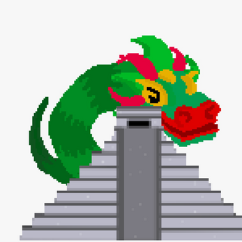

# Welcome to Deverso

## Homepage: https://joandgg.github.io

Some quotes :P
> _Produce ideas that generate a positive impact in those that I can help, directly or not, through my own universe_
> 
> _The noblest art is that of making others happy -PT Barnum_
> 
> _The greater the struggle, the most glorious the triumph -The butterfly circus_

This is a personal portfolio to showcase what I consider my best collection of work so far as well as a [brief introduction of myself](https://github.com/JoanDGG/JoanDGG.github.io/blob/main/README.md#introduction), thank you for reading!

## Introduction

Deverso (me) is a solodev studio focused on creating games that offer high-impact experiences, to think about life, appretiate the little things, and have fun :)

### [Itch.io page](https://deversogg.itch.io) (where you can find most of my published games)

### [LinkedIn](https://www.linkedin.com/in/joan-daniel-guerrero-garcia/) (cuz why not)

## Showcase
```markdown
Experience

- [**PROYECTO MARTE**](./Documents/Documentacion%20proyecto%20marte.pdf)
[Github repository](https://github.com/JoanDGG/Proyecto-Marte)
Developed a 2D video game with `Unity 2D` Engine using `C#`, with the purpose of spreading STEAM’s mission while obtaining user’s data through a `MySQL` database.

- [**APP DIBUJANDO UN MAÑANA**](./Documents/Documentacion%20dibujando%20un%20ma%C3%B1ana.pdf)
[Github repository](https://github.com/aenco9/dibujandoApp)
Developed a mobile app with `Android Studio` using `Kotlin` which promotes the activities and donations done by the foundation Dibujando un mañana. Connected the app with a `Firebase` database and uses the `PayPal` services.

- **SIMULATION APP DEVELOPMENT**
[Github repository](https://github.com/JoanDGG/Modelo-multiagentes)
Created a 3D multi-agent traffic visualization displayed in `Unity 3D Engine`, using `Mesa AI` agent framework in `Python`.

- **TECMEX APP**
[Github repository](https://github.com/AmazonConnect-TECCEM-502)
Working on a full stack solution for a contact center using Amazon Connect and AWS services, producing the interface with React
```

### Games showcase


*	[“Honey, you’re dreaming”](https://arcade-dogo.itch.io/honey-youre-dreaming) Game created using `Unity 2D` during Game Jam ‘Brackeys Game Jam 2022.1’ (2022)


*	[“TGUCC”](https://deversogg.itch.io/tgucc) Game created using `Unity 2D` during Game Jam ‘Spooky Jam 2021’ (2021)


*	[“Break”](https://arcade-dogo.itch.io/break) Game created using `Unity 2D` during Game Jam ‘Mini jam 87: Break’ (2021)


*	[“Time Twist Mayhem”](https://deversogg.itch.io/time-twist-mayhem) Game created using `Unity 2D` during Game Jam ‘A jam about time’ (2021)


*	[“Personal space”](https://deversogg.itch.io/personal-space) Chill personal game created using `Unity 2D` in 24 hours (2021)


*	[“Yaoyotl”](https://dany-guy.itch.io/yaoyotl) Game created using `Unity 2D` during Game Jam ‘Game Jam 2021 from Tec de Monterrey’ (2020)


*	[“Space Rocks”](https://deversogg.itch.io/space-rocks) Fan game created using `GameMaker Studio 2` in honor of the classic game ‘Asteroids’ (2019)


*	[“Neko game!!”](https://deversogg.itch.io/neko-game) Fan game created using `GameMaker Studio 2` in honor of the Windows phone game ‘Neko’ (2019)


*	[“Space Intruder”](https://deversogg.itch.io/space-intruders) Fan game created using `GameMaker Studio 2` in honor of the classic game ‘Space Invaders’ (2019) 
